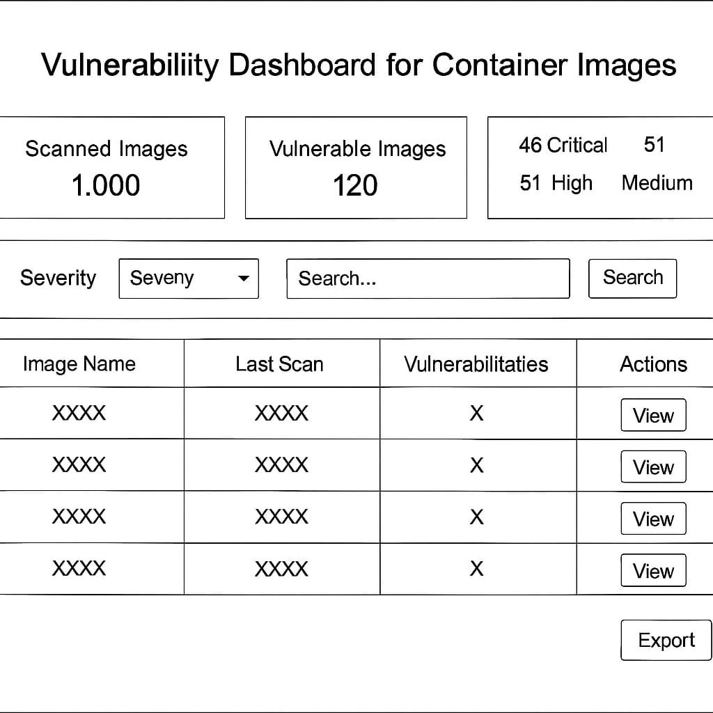

# 🛡️ Problem 1: Product Requirement and Low-Fidelity Wireframes

## 📘 Background

A security product requires scanning container images and showing users the findings.  
Container images include applications and dependencies that may have **known vulnerabilities**.

---

## 🧑‍💻 User Problem

As a user, I need to:

- Identify **which container images** have vulnerabilities
- Know **how severe** the vulnerabilities are
- Prioritize fixing **Critical** and **High** vulnerabilities
- Handle **thousands of images** in my repository efficiently

---

## 🎯 Goals

- Provide visibility into container image vulnerabilities
- Allow filtering and searching based on severity or image name
- Enable users to navigate large repositories quickly
- Prioritize remediation for critical security issues

---

## 🛠 Features

| Feature                          | Description                                                                 |
|----------------------------------|-----------------------------------------------------------------------------|
| 🔍 Search                        | Search container images by name                                            |
| ⚠️ Severity Filters              | Filter results by Critical, High, Medium, Low                              |
| 📊 Vulnerability Summary         | Total number of images, vulnerable images, and breakdown by severity       |
| 📄 Image Detail View             | Detailed list of vulnerabilities for a selected image                      |
| 📥 Export Button                 | Export scan results to a file                                              |

---

## 🧪 Target Users

- DevOps Engineers
- Security Teams managing CI/CD pipelines
- SREs and Infrastructure Teams

---

## 📈 Metrics for Success

- Number of critical vulnerabilities resolved
- Time taken to identify vulnerable images
- User adoption and ease of use

---

## 🔧 Optional Dev Action Items

- Use container scanning tool (e.g., Trivy)
- Backend API to fetch and paginate scan results
- Frontend dashboard with filtering and severity color-coding

---

## 🖼️ Wireframe – Dashboard View

Below is a low-fidelity wireframe representing the **Container Image Vulnerability Dashboard**:

---

## ✅ Deliverables

- [x] Product Requirement Document
- [x] Low-Fidelity Wireframe (Dashboard View)
- [ ] Wireframe (Details Page) – *optional or coming soon*
